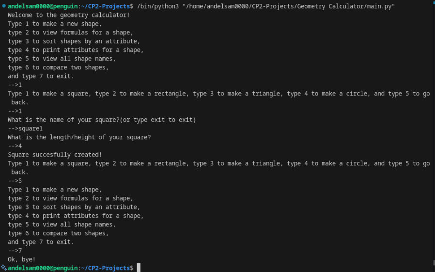

# Geometry Calculator

## Project Description
---
This project creates shapes (triangles, circles, squares, and rectangles) and compares them to each other. This program can also sort the shapes by attributes like area and perimeter. There is a feature that allows you to view the formulas for the area and perimeter of a shape as well.  

## Installation
---
1. Install the extension 'python', click the first item
2. Install the extension 'jupyter', click the first item
3. Install the extension 'coderunner', click the first item    

## Execution
---

+ click the play button in the top right corner
+ choose from the selection of options in the terminal
+ Select 7 to exit at any time

   

## Used Technologies
---
+ No special used technologies

## Current Features
---
+ This project is able to create shapes based off of classes
+ This project is able to compare and sort shapes by attributes
+ Offers four different shapes  

## Contributing
---

## Contributors
---
+ Samuel --> made the whole project

## Author's Info
---
My name is Samuel Andelin, I am in a programming class where I get to code stuff, which is pretty fun. I like to play videogames and like to code as well. I mostly code in Python, but I have coded in some Rust. I definitely prefer python because it is a lot less hassle to be secure, but that is probably more important than it being easy.  

## Change log
---

## License
---
